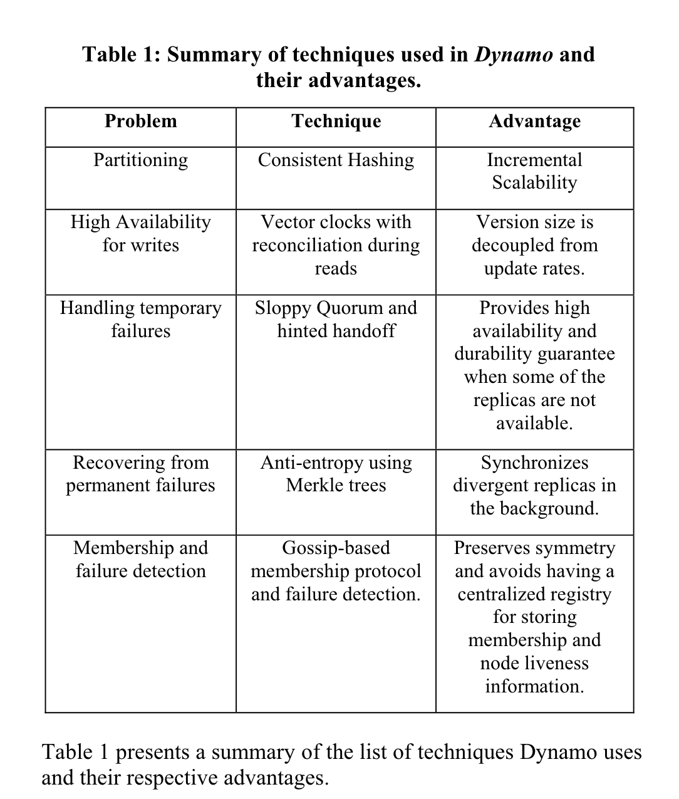
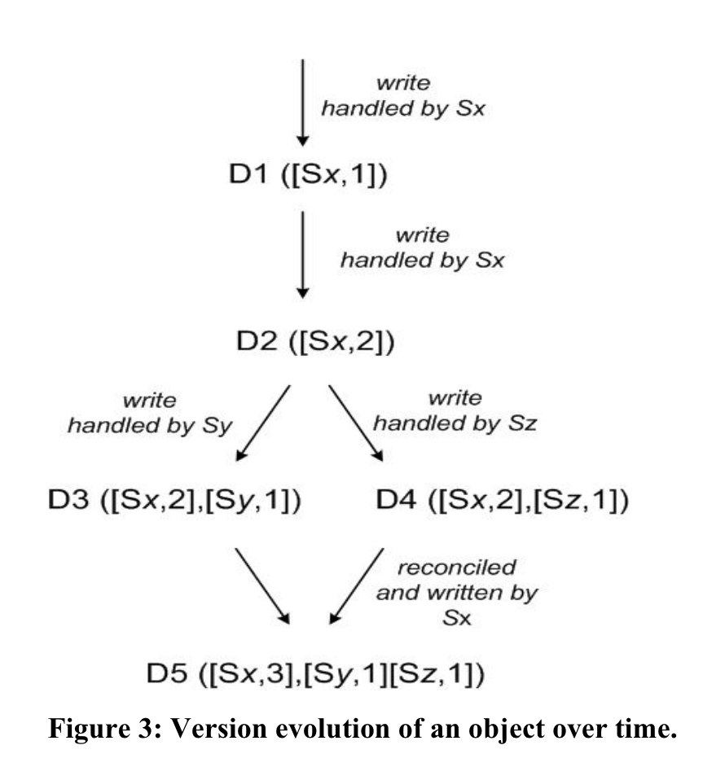

## takeaways

- [ ] TODO: Learn more about how Merkle trees are used for replica synchronization.

- Dynamo is a key-value store.
- Highly scalable and available, while sacrificing for eventual consistency.
- Strategies used:
	- Consistent hashing for partitioning of data.
	- Leaderless replication using quorum-style consensus with configurable N, R, and W values.
	- Conflict resolution can be performed by the application or with simple heuristics like last-write-wins at the database level.
		- Version vectors are stored per key, and any diverging histories are fixed on a read, and the read repair is performed for nodes that have stale data.

## highlights

<a href="zotero://open-pdf/library/items/3MWL4ZV6?page=1&#x26;annotation=3NVFBMP3">“For example, customers should be able to view and add items to their shopping cart even if disks are failing, network routes are flapping, or data centers are being destroyed by tornados.”</a> (<a href="zotero://select/library/items/IAHP4AR8">DeCandia et al., p. 195</a>)

<a href="zotero://open-pdf/library/items/3MWL4ZV6?page=1&#x26;annotation=RU5MYUS4">“Amazon’s software systems need to be constructed in a manner that treats failure handling as the normal case without impacting availability or performance.”</a> (<a href="zotero://select/library/items/IAHP4AR8">DeCandia et al., p. 195</a>)

<a href="zotero://open-pdf/library/items/3MWL4ZV6?page=2&#x26;annotation=I4KTUDU7">“the service that maintains shopping cart (Shopping Cart Service) served tens of millions requests that resulted in well over 3 million checkouts in a single day”</a> (<a href="zotero://select/library/items/IAHP4AR8">DeCandia et al., p. 196</a>)

> Even though it's pretty obvious once you think about it, it is cool that there's a whole service needed just to handle shopping cart state!

<a href="zotero://open-pdf/library/items/3MWL4ZV6?page=2&#x26;annotation=SCM6E2PT">“For many of the more common usage patterns of state persistence, however, a relational database is a solution that is far from ideal. Most of these services only store and retrieve data by primary key and do not require the complex querying and management functionality offered by an RDBMS.”</a> (<a href="zotero://select/library/items/IAHP4AR8">DeCandia et al., p. 196</a>) This is an interesting point that goes against what is typically first taught in schools and beginner coding workshops, but it's definitely true!

<a href="zotero://open-pdf/library/items/3MWL4ZV6?page=2&#x26;annotation=LFPZH9H8">“No operations span multiple data items and there is no need for relational schema.”</a> (<a href="zotero://select/library/items/IAHP4AR8">DeCandia et al., p. 196</a>)

<a href="zotero://open-pdf/library/items/3MWL4ZV6?page=2&#x26;annotation=V6J2TKY9">“Dynamo does not provide any isolation guarantees and permits only single key updates.”</a> (<a href="zotero://select/library/items/IAHP4AR8">DeCandia et al., p. 196</a>) Because each query can only ever edit one key, there's no need to "isolate" a transaction from other transactions, because as long as the two concurrent transactions aren't operating on the same key, we're fine.

<a href="zotero://open-pdf/library/items/3MWL4ZV6?page=3&#x26;annotation=D4V2IHHS">“An SLA stated in terms of mean or median response times will not address the performance of this important customer segment. To address this issue, at Amazon, SLAs are expressed and measured at the 99.9th percentile of the distribution.”</a> (<a href="zotero://select/library/items/IAHP4AR8">DeCandia et al., p. 197</a>)

<a href="zotero://open-pdf/library/items/3MWL4ZV6?page=3&#x26;annotation=X2LS4WE8">“Many traditional data stores execute conflict resolution during writes and keep the read complexity simple [7]. In such systems, writes may be rejected if the data store cannot reach all (or a majority of) the replicas at a given time. On the other hand, Dynamo targets the design space of an “always writeable” data store (i.e., a data store that is highly available for writes). For a number of Amazon services, rejecting customer updates could result in a poor customer experience. For instance, the shopping cart service must allow customers to add and remove items from their shopping cart even amidst network and server failures.”</a> (<a href="zotero://select/library/items/IAHP4AR8">DeCandia et al., p. 197</a>)

(<a href="zotero://select/library/items/IAHP4AR8">DeCandia et al., p. 198</a>) Dynamo allows for applications to define conflict-resolution logic, but allows falling back to simple mechanisms like last-write-wins.

<a href="zotero://open-pdf/library/items/3MWL4ZV6?page=5&#x26;annotation=P5A43W23">“Dynamo’s partitioning scheme relies on consistent hashing to distribute the load across multiple storage hosts.”</a> (<a href="zotero://select/library/items/IAHP4AR8">DeCandia et al., p. 199</a>)

<a href="zotero://open-pdf/library/items/3MWL4ZV6?page=6&#x26;annotation=N3AMLA9C">“The number of virtual nodes that a node is responsible can decided based on its capacity, accounting for heterogeneity in the physical infrastructure.”</a> (<a href="zotero://select/library/items/IAHP4AR8">DeCandia et al., p. 200</a>)

<a href="zotero://open-pdf/library/items/3MWL4ZV6?page=6&#x26;annotation=24S4PUC4">“Each key, k, is assigned to a coordinator node (described in the previous section). The coordinator is in charge of the replication of the data items that fall within its range. In addition to locally storing each key within its range, the coordinator replicates these keys at the N-1 clockwise successor nodes in the ring.”</a> (<a href="zotero://select/library/items/IAHP4AR8">DeCandia et al., p. 200</a>)

<a href="zotero://open-pdf/library/items/3MWL4ZV6?page=6&#x26;annotation=7SWKAJ4D">“Dynamo uses vector clocks [12] in order to capture causality between different versions of the same object.”</a> (<a href="zotero://select/library/items/IAHP4AR8">DeCandia et al., p. 200</a>)

<a href="zotero://open-pdf/library/items/3MWL4ZV6?page=7&#x26;annotation=PI4TQKVR">“A node handling a read or write operation is known as the coordinator. Typically, this is the first among the top N nodes in the preference list. If the requests are received through a load balancer, requests to access a key may be routed to any random node in the ring. In this scenario, the node that receives the request will not coordinate it if the node is not in the top N of the requested key’s preference list. Instead, that node will forward the request to the first among the top N nodes in the preference list.”</a> (<a href="zotero://select/library/items/IAHP4AR8">DeCandia et al., p. 201</a>)

<a href="zotero://open-pdf/library/items/3MWL4ZV6?page=7&#x26;annotation=NNBDM2IC">“To maintain consistency among its replicas, Dynamo uses a consistency protocol similar to those used in quorum systems.”</a> (<a href="zotero://select/library/items/IAHP4AR8">DeCandia et al., p. 201</a>)

<a href="zotero://open-pdf/library/items/3MWL4ZV6?page=8&#x26;annotation=NNJC7W5B">“In this example, if node A is temporarily down or unreachable during a write operation then a replica that would normally have lived on A will now be sent to node D. This is done to maintain the desired availability and durability guarantees. The replica sent to D will have a hint in its metadata that suggests which node was the intended recipient of the replica (in this case A). Nodes that receive hinted replicas will keep them in a separate local database that is scanned periodically. Upon detecting that A has recovered, D will attempt to deliver the replica to A. Once the transfer succeeds, D may delete the object from its local store without decreasing the total number of replicas in the system.”</a> (<a href="zotero://select/library/items/IAHP4AR8">DeCandia et al., p. 202</a>) How hinted handoff works.

<a href="zotero://open-pdf/library/items/3MWL4ZV6?page=8&#x26;annotation=LUVWLDE7">“In essence, the preference list of a key is constructed such that the storage nodes are spread across multiple data centers.”</a> (<a href="zotero://select/library/items/IAHP4AR8">DeCandia et al., p. 202</a>)

<a href="zotero://open-pdf/library/items/3MWL4ZV6?page=8&#x26;annotation=2ENK6LN3">“A gossip-based protocol propagates membership changes and maintains an eventually consistent view of membership. Each node contacts a peer chosen at random every second and the two nodes efficiently reconcile their persisted membership change histories.”</a> (<a href="zotero://select/library/items/IAHP4AR8">DeCandia et al., p. 202</a>)

<a href="zotero://open-pdf/library/items/3MWL4ZV6?page=10&#x26;annotation=KE587JIN">“The main advantage of Dynamo is that its client applications can tune the values of N, R and W to achieve their desired levels of performance, availability and durability.”</a> (<a href="zotero://select/library/items/IAHP4AR8">DeCandia et al., p. 204</a>)

<a href="zotero://open-pdf/library/items/3MWL4ZV6?page=13&#x26;annotation=2YZZWRX6">“Any Dynamo node can act as a coordinator for a read request. Write requests on the other hand will be coordinated by a node in the key’s current preference list.”</a> (<a href="zotero://select/library/items/IAHP4AR8">DeCandia et al., p. 207</a>)

<a href="zotero://open-pdf/library/items/3MWL4ZV6?page=13&#x26;annotation=L3TLCVJJ">“An alternative approach to request coordination is to move the state machine to the client nodes. In this scheme client applications use a library to perform request coordination locally. A client periodically picks a random Dynamo node and downloads its current view of Dynamo membership state. Using this information the client can determine which set of nodes form the preference list for any given key. Read requests can be coordinated at the client node thereby avoiding the extra network hop that is incurred if the request were assigned to a random Dynamo node by the load balancer.”</a> (<a href="zotero://select/library/items/IAHP4AR8">DeCandia et al., p. 207</a>)

## references

- https://s3.amazonaws.com/systemsandpapers/papers/amazon-dynamo-sosp2007.pdf
